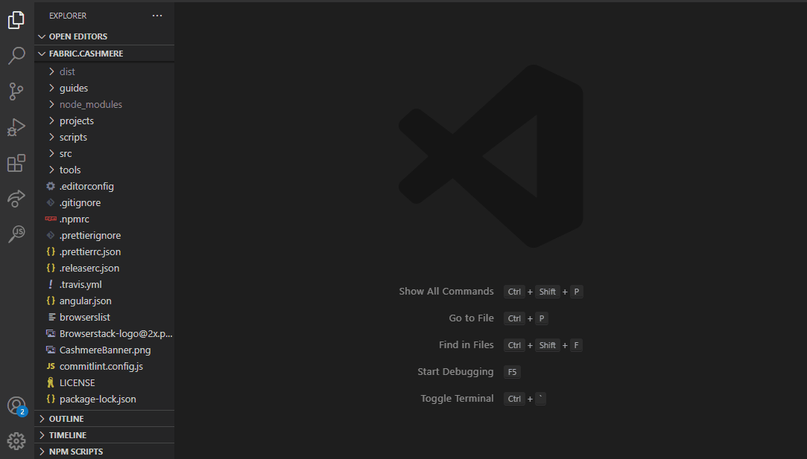
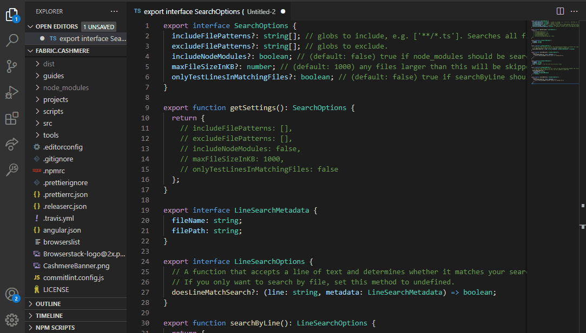
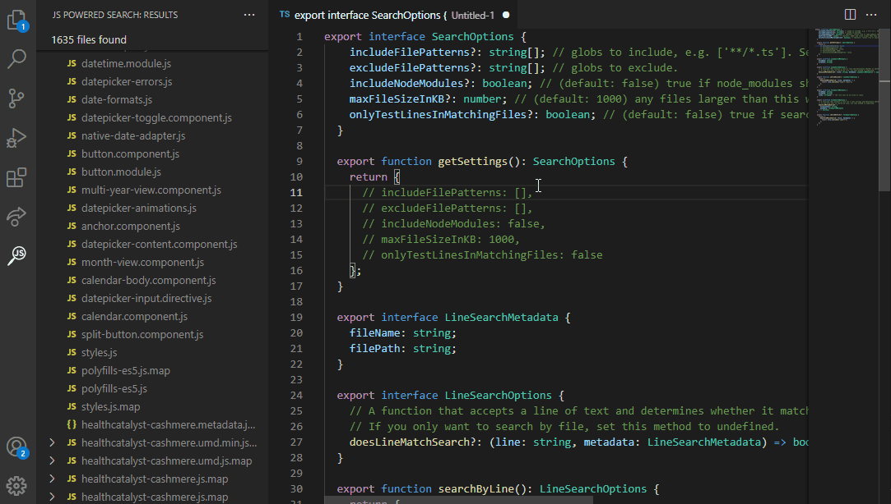

# JS Powered Search

**Array.filter for every file in your codebase**

Suppose you're working in a large codebase and for personal reasons you need to find every file with a `.cs` extension that imports `urlUtilityClass`, uses the `urlJoin` method of that class two or more times, uses the `protocolReplace` method of that class _exactly three times_, and _never_ uses the `validateUrl` method of that class. (It's okay, we're all working with legacy code here.) Feel a RegEx headache coming on?

JS Powered Search (JSPS) is a simple engine for searching a project using the full power of JavaScript. It's more powerful than RegEx and _way_ more powerful than a text search, although it has the ability to do both. Any stateful logic you can write with code, you can use in JSPS -- search depth, complexity, and performance are all up to you.

JSPS scaffolds a self-contained search definition file which you can alter by writing code to determine whether each file or line of code matches your search. You can save useful search definitions to your computer, making it easy to run them from the Command Palette or the JSPS Results pane later. If you commit your search definitions to version control, the whole team can use them just as easily.

Contribute here: https://github.com/isaaclyman/jsPoweredSearch

Buy me a Coke: https://paypal.me/isaaclyman

## Features

Scaffold a powerful Search Definition file instantly:

Configure search settings and write matchers. In this case, we're looking for TypeScript files that have at least three imports and export a class whose name includes the term "Component".

Run the search whenever you're ready, and results will show up in the JSPS Results pane.

## How to begin

Open the Command Palette with Ctrl + Shift + P. JS Powered Search provides two commands:

### Scaffold

This creates a search definition file. JSPS will ask if you want to use a new unsaved editor window, create a new file at the project root, or overwrite the currently active file. Whatever you choose, you'll get a TypeScript file with three exported functions: one that returns general settings for your search, one that returns line matching functionality, and one that returns file matching functionality. TypeScript interfaces for every type you'll be interacting with are fully defined in the file.

From here, defining your search parameters is up to you. You can use multiple globs to include and exclude files by directory, filename, and extension. You can opt out of line matching, file matching, or both. You can write as much or as little logic in each matcher as you want, maintaining state with the provided closures (but keep in mind that files are not searched sequentially or in any particular order).

### Search

This executes a full workspace search using the currently active file as a search definition. JSPS will let you know if there's something wrong with your file, and the operation can be cancelled at any point. The JSPS Results pane will open to show results as they come in. Click any search result to jump to it in your codebase, or click the X icon to dismiss it.

## Known Issues

- Extension is in preview.
- Search definition files should not import other files. This is untested behavior and not currently in scope.

## Wishlist

- Allow passing in "test files" or "test lines" to the appropriate functions. The user indicates whether the contents should pass or fail the test defined by the predicate. Tests must pass before search begins; otherwise, the user sees an error message. This will give a quick understanding of what the test is looking for.
- Allow imports in search definition files. (This probably doesn't work and may not be possible.)
- Write tests for this extension to ensure maintainability.
- Do a performance check before the search. Test the matchers on 1 file to make sure they'll run without errors. Then test them on 10 files to get an idea for how fast they are. If average time per file \* number of files matched > 30 seconds, warn the user and give them the option to cancel.
